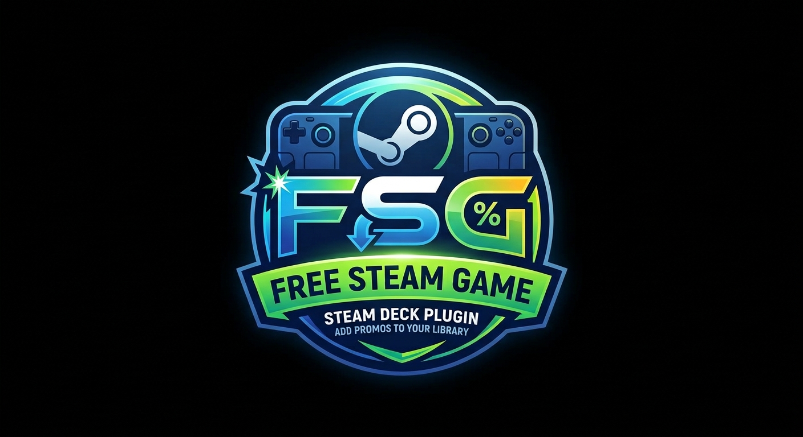
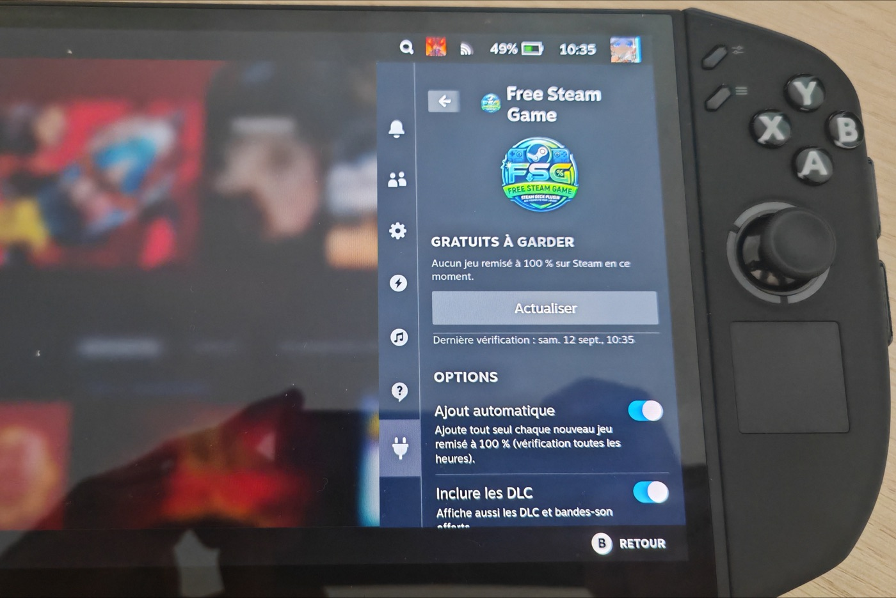
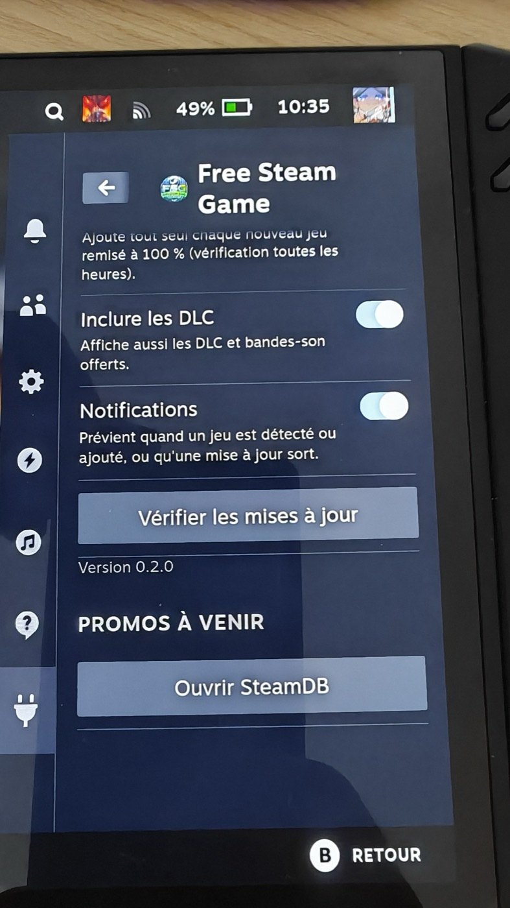
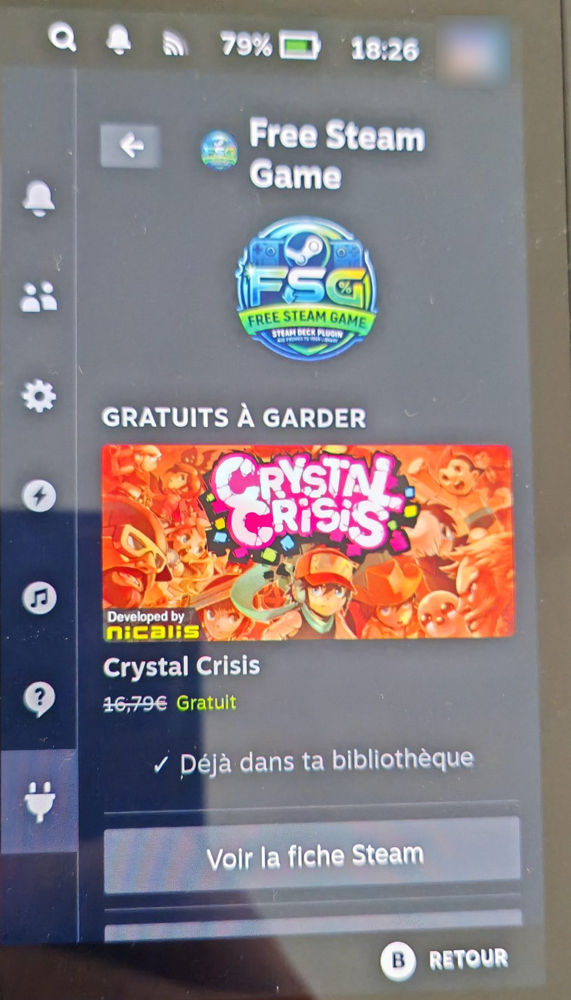
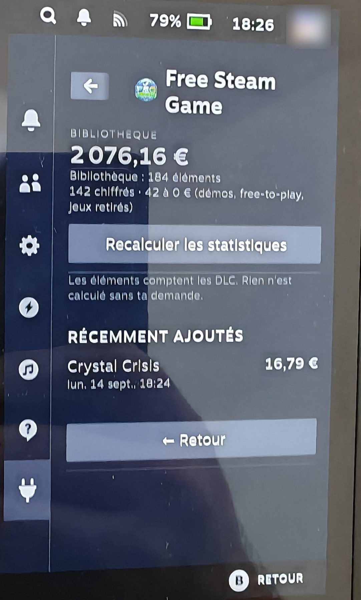
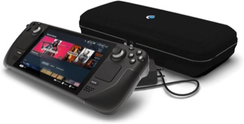
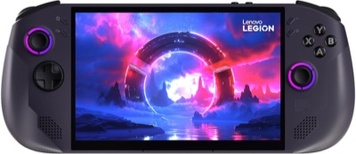
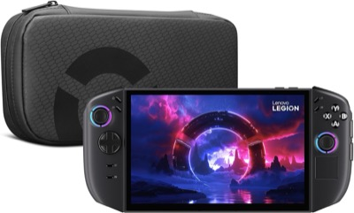

<p align="center"></p>

<p align="center"><b>English</b> · <a href="README.fr.md">Français</a></p>

# FSG — Free Steam Game

**[Decky Loader](https://decky.xyz/)** plugin for **SteamOS** (Steam Deck, Lenovo Legion Go S / Go 2…). It lists Steam games that are **free to keep** (temporary 100% discount) in the Quick Access Menu, and adds them to your library in one click, or on its own.

## 📸 Preview

<p align="center"></p>

<p align="center"></p>

<p align="center"><em>FSG running on a Lenovo Legion Go 2 (SteamOS), with the French interface.</em></p>

### ✅ Tested for real

On September 14, 2026, **Crystal Crisis** (€16.79) went 100% off: FSG **added it to the library on its own** as soon as the Legion Go 2 was turned on, without any action.

<p align="center">
  
  &nbsp;
  
</p>

<p align="center"><em>Left, the game marked "Already in your library"; right, the Statistics view (0.4.0 beta) listing it under "Recently added".</em></p>

## ✨ Features

- List of the current free promos, read straight from the Steam store: normal price, end date when Steam shows it.
- **Add to my library**: adds the free license to your account without opening the Store.
- **Automatic add** (option, on by default): checks every hour; every new game at €0 is added and a notification shows up.
- Optional free DLC, notifications can be turned off.
- **Open SteamDB**: shows upcoming promos in Steam's browser.
- **English or French interface**, picked automatically from Steam's language (game names and prices follow too).

## 📥 Installation

Requirement: a SteamOS console with [Decky Loader](https://decky.xyz/) installed.

### From the console, by URL (easiest)

1. Decky → ⚙️ Settings → General → turn on **Developer mode**.
2. Decky → ⚙️ → **Developer** → **Install plugin from URL**, then paste:
   ```
   https://github.com/koua29/decky-fsg/releases/latest/download/FSG.zip
   ```
3. Confirm: **FSG** shows up in the Decky plugin list.

### With the ZIP file

Download `FSG.zip` from the [Releases](https://github.com/koua29/decky-fsg/releases) page, then Decky → ⚙️ → Developer → **Install plugin from ZIP file**.

## ⚙️ How it works

- **Promos**: Steam store search `maxprice=free&specials=1` (paid games shown at €0), then `appdetails` and the game page to find the free package (`subid`).
- **Adding**: the same request as the store's "Add to Account" button (`/freelicense/addfreelicense/<subid>`), then a check in the account's license list.
- **Session**: the plugin reads the store cookies locally from Steam's built-in browser, through the CEF debugging port Decky already uses (`127.0.0.1:8080`). They are only sent to `store.steampowered.com`.

SteamDB is not queried automatically: the site blocks requests that do not come from a browser (Cloudflare, HTTP 403).

**Status**: young project (0.x). If something goes wrong, the logs are in `~/homebrew/logs/FSG/`: open an [issue](https://github.com/koua29/decky-fsg/issues) with their content.

## 🔄 Updates

FSG checks once a day whether a new version is available on GitHub. When there is one, a notification shows up and the panel offers **Update to X.Y.Z**: Decky opens its usual confirmation window, checks the zip's SHA-256 checksum, then reloads the plugin. Settings and history are stored outside the plugin folder, in `~/homebrew/settings/FSG/` and `~/homebrew/data/FSG/`, and are left untouched.

You can also check by hand (Options → **Check for updates**), or reinstall from the URL above, which always points to the latest version.

From 0.1.0, which does not have this check, you need to reinstall once from the URL.

Each version is published in the [Releases](https://github.com/koua29/decky-fsg/releases) with a `vX.Y.Z` tag and its changelog.

### Beta versions

Options → **Beta versions** also looks at test versions (`vX.Y.Z-beta.N` tags, published as *pre-releases* on GitHub). They come earlier and may be unstable; without this option, FSG only offers stable versions.

Turning the option off while a beta is installed makes the panel offer to **go back to the latest stable version**.

## 🛠️ Development

```bash
npm install
npm run build
```

Package: a `FSG/` folder containing `dist/`, `main.py`, `plugin.json`, `package.json`, `LICENSE` and `README.md`.

## 🎮 SteamOS consoles

*Amazon affiliate links (amazon.fr): if you buy through these links, the project earns a small commission at no extra cost to you. These are SteamOS handhelds FSG installs on with Decky Loader.*

<table>
<tr>
<td align="center" width="33%">
  <a href="https://www.amazon.fr/dp/B0CQ3RWQQZ?&amp;linkCode=ll2&amp;tag=koua29-21&amp;linkId=d8fe32650df59e4b587c0f3faa6e2762&amp;ref_=as_li_ss_tl"></a><br>
  <b><a href="https://www.amazon.fr/dp/B0CQ3RWQQZ?&amp;linkCode=ll2&amp;tag=koua29-21&amp;linkId=d8fe32650df59e4b587c0f3faa6e2762&amp;ref_=as_li_ss_tl">Steam Deck OLED</a></b><br><sub>Valve's SteamOS handheld</sub>
</td>
<td align="center" width="33%">
  <a href="https://www.amazon.fr/dp/B0DWFY5G1N?th=1&amp;linkCode=ll2&amp;tag=koua29-21&amp;linkId=27547fe4ab70827a6cc109b4a539d5a4&amp;ref_=as_li_ss_tl"></a><br>
  <b><a href="https://www.amazon.fr/dp/B0DWFY5G1N?th=1&amp;linkCode=ll2&amp;tag=koua29-21&amp;linkId=27547fe4ab70827a6cc109b4a539d5a4&amp;ref_=as_li_ss_tl">Lenovo Legion Go S</a></b><br><sub>Ships with SteamOS</sub>
</td>
<td align="center" width="33%">
  <a href="https://www.amazon.fr/dp/B0FYR394K5?&amp;linkCode=ll2&amp;tag=koua29-21&amp;linkId=094466eff2c7717ecebc49e8bf0f3a85&amp;ref_=as_li_ss_tl"></a><br>
  <b><a href="https://www.amazon.fr/dp/B0FYR394K5?&amp;linkCode=ll2&amp;tag=koua29-21&amp;linkId=094466eff2c7717ecebc49e8bf0f3a85&amp;ref_=as_li_ss_tl">Lenovo Legion Go 2</a></b><br><sub>8.8&quot; OLED screen · SteamOS compatible</sub>
</td>
</tr>
</table>

<sub>As an Amazon Associate I earn from qualifying purchases. · En tant que Partenaire Amazon, je réalise un bénéfice sur les achats remplissant les conditions requises.</sub>

## ☕ Buy me a coffee

This project is free and open source. If it helps you, you can say thanks
by buying me a coffee — just scan this PayPal QR code. Thank you very much! 🙏

<p align="center">
  
</p>

## 📄 License

**MIT** — see [LICENSE](LICENSE). Unofficial project, not affiliated with Valve or Lenovo. Steam and SteamOS are trademarks of Valve Corporation.
